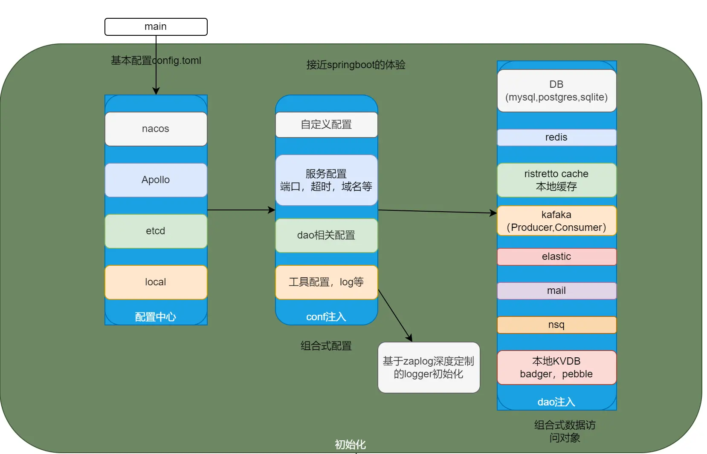

# initialize
基于反射自动注入的配置及dao注入初始化，并暴露一个全局变量，记录模块信息


## example
`go run _example/main.go -c _example/config.toml`
## 一个应用的启动，应该如此简单
### config（配置）
支持nacos,local file,http请求作为配置中心,可扩展支持etcd,apollo,viper(获取配置代理，底层是其他配置中心)，支持viper支持的所有格式("json", "toml", "yaml", "yml", "properties", "props", "prop", "hcl", "tfvars", "dotenv", "env", "ini")的配置文件，
支持dev，test，prod环境本，启动命令区分

### 配置模板
```toml
# dev | test | stage | prod |...
Env = "dev" # 将会选择与Env名字相同的环境配置
[dev]
ConfigTemplateDir = "." # 模板目录,将会生成配置模板
```
仅需以上最小配置,点击启动,即可生成配置模板
如果还是麻烦,试试直接用 `--format ${配置格式} -e ${环境} -p ${模板路径}`  启动吧
## 启动配置
仅需配置配置中心,后续配置均从配置中心拉取及自动更新
```toml
Module = "hoper"
# dev | test | stage | prod |...
Env = "dev" # 将会选择与Env名字相同的环境配置

[dev] 
debug = true
ConfigTemplateDir = "." # 将会生成配置模板
# 上方是一个个初始配置,如果不知道如何进行接下来的配置,可以先启动生成配置模板
[dev.ConfigCenter]
Type = "local"
Watch  = true
NoInject = ["Apollo","Etcd", "Es"]

[dev.ConfigCenter.local]
Debug = true
ConfigPath = "local.toml"
ReloadType = "fsnotify"

[dev.ConfigCenter.http]
Interval = 10000000000
Url = "http://localhost:6666/local.toml"

[dev.ConfigCenter.nacos]
DataId = "pro"
Group = "DEFAULT_GROUP"

[[dev.ConfigCenter.nacos.ServerConfigs]]
Scheme = "http"
IpAddr = "nacos"
Port = 9000
GrpcPort = 10000

[dev.ConfigCenter.nacos.ClientConfig]
NamespaceId = "xxx"
username = "nacos"
password = "nacos"
LogLevel = "debug"

```
```go
import(
  "github.com/hopeio/cherry"
)
type config struct {
	//自定义的配置
	Customize serverConfig
}
type serverConfig struct{
    TokenMaxAge time.Duration
}


// 注入配置前初始化
func (c *config) BeforeInject() {
    c.Customize.TokenMaxAge = time.Second * 60 * 60 * 24
}
// 注入配置后初始化
func (c *config) AfterInject() {
	c.Customize.TokenMaxAge = time.Second * 60 * 60 * 24 * c.Customize.TokenMaxAge
}

func main() {
	global:= initialize.NewGlobal[*config,*initialize.EmbeddedPresets]()
    //配置初始化应该在第一位
    defer global.Cleanup()
}
```
如果还有Dao要初始化
```go
import(
    "github.com/hopeio/initialize/conf_dao/gormdb/sqlite"
    initredis "github.com/hopeio/initialize/conf_dao/redis"
)
// dao dao.
type dao struct {
	// GORMDB 数据库连接
	GORMDB   *sqlite.DB
	StdDB    *sql.DB
}
// 注入配置前初始化
func (c *dao) BeforeInject() {
}
// 注入配置后初始化
func (c *dao) AfterInjectConfig() {
}
// 注入dao后初始化
func (d *dao) AfterInject() {
	db := d.GORMDB
	db.Callback().Create().Remove("gorm:save_before_associations")
	db.Callback().Create().Remove("gorm:save_after_associations")
	db.Callback().Update().Remove("gorm:save_before_associations")
	db.Callback().Update().Remove("gorm:save_after_associations")

	d.StdDB, _ = db.DB()
}
func main() {
    global:= initialize.NewGlobal[*config,*dao]()
    defer global.Cleanup()
}
```
原生集成了redis,gormdb(mysql,postgressql,sqlite),kafka,pebbledb,apollo,badgerdb,etcd,elasticsearch,nsq,ristretto,viper等，并且非常简单的支持自定义扩展,不局限于Dao对象，任何对象都支持根据配置自动注入生成


```go
// initWithRootConfig
import "github.com/hopeio/initialize/rootconf"
func (c *conf) BeforeInjectWithRoot(root *rootconf.RootConfig) {
}
func (c *dao) BeforeInjectWithRoot(root *rootconf.RootConfig) {
}
// AfterInjectConfigWithRoot(*rootconf.RootConfig)
// AfterInjectWithRoot(*rootconf.RootConfig)
```
# 基于环境的配置
需要配置中心的配置
## 生成模板
配置中心模板最少配置
```toml
env = "dev"

[dev]
ConfigTemplateDir = "."
```

如果单纯想生成模板,可以不用基本配置,直接用`--format ${配置格式} -e ${环境} -p ${模板路径}` 启动

# 单配置文件
如果你的项目不需要分环境,那么不要env这个配置,不要 -e flag,直接在启动目录放一个config.xxx文件即可
或者可以手动指定`-c ${配置文件}`
## 生成模板
要为单配置文件生成模板`--format ${配置格式} -p ${模板路径}`