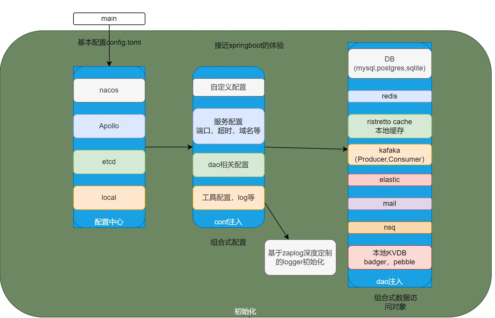

# initialize

[](https://pkg.go.dev/github.com/hopeio/initialize)
[](https://go.dev/)
[](LICENSE)

[中文文档](README.zh-CN.md)

Reflection-based bootstrap for **config** and **DAO** — declare fields, get wired clients.



```bash
go get github.com/hopeio/initialize@latest
```

## What is initialize?

**initialize** loads application configuration (local files and/or remote centers), then reflectively constructs data-access objects (Redis, GORM, message queues, …) from struct fields.

You define `Config` and `Dao` types, call `NewGlobal`, and get a single process-wide handle with lifecycle hooks and cleanup.

It does **not** dictate how you serve HTTP or gRPC. It only owns bootstrap: config → inject → ready.

## Features

- **Root config** — app name, environment (`dev` / `test` / `prod` / custom), paths to local files and config centers (not hot-reloaded)
- **Local multi-file** — merge several paths; optional filesystem watch
- **Remote centers** — Nacos, Apollo, etcd, HTTP; register your own
- **Formats** — everything Viper supports (JSON, TOML, YAML, INI, dotenv, …)
- **Overrides** — environment variables and command-line flags via struct tags
- **DAO plugins (`contrib/`)** — GORM (MySQL / Postgres / SQLite), Redis, Kafka (sarama / confluent), NATS, NSQ, etcd, Elasticsearch, MinIO, MQTT, Badger, Pebble, Ristretto, InfluxDB, …
- **Templates** — generate a config skeleton from your structs
- **Hooks** — `BeforeInject` / `AfterInjectConfig` / `AfterInject` (and `*WithRoot` variants)
- **Cleanup** — `Cleanup()` and `Defer(fn)` for orderly shutdown

## Quick start

```bash
go run _example/main.go -c _example/config/config.toml
```

```go
package global

import (
	"time"

	"github.com/hopeio/initialize"
	"github.com/hopeio/initialize/contrib/gormdb/sqlite"
	initredis "github.com/hopeio/initialize/contrib/redis"
)

type config struct {
	initialize.EmbeddedPresets
	Customize struct {
		TokenMaxAge time.Duration
	}
}

func (c *config) BeforeInject() {
	c.Customize.TokenMaxAge = 24 * time.Hour
}

type dao struct {
	initialize.EmbeddedPresets
	GORMDB *sqlite.DB
	Redis  *initredis.Client
}

func (d *dao) AfterInject() {
	// tune pools, register callbacks, etc.
}

var Global = initialize.NewGlobal[*config, *dao]()
```

```go
func main() {
	defer Global.Cleanup()
	_ = Global.Config
	_ = Global.Dao
}
```

Minimal root TOML:

```toml
Name = "myapp"
Env = "dev"

[dev]
debug = true
ConfigTemplateDir = "."

[dev.localConfig]
Paths = ["local.toml"]
ReloadInterval = "1s"
```

Single-environment apps can skip `Env` and use `-c` / a local `config.*` file.

## Lifecycle

| Hook | When |
|------|------|
| `BeforeInject` (+ `WithRoot`) | Before unmarshalling into your structs |
| `AfterInjectConfig` (+ `WithRoot`) | Config ready; DAO `Init` not finished |
| `AfterInject` (+ `WithRoot`) | All DAO fields initialized |

Use `SkipInjectDaos` in root config to skip named fields when a dependency is unavailable locally.

## Writing a plugin

Implement `DaoField` (`Config()` / `Init()` / `Closer`) or the generic `DaoG` / `DaoConfig` helpers — same injection path as built-in contrib packages.

## License

[MIT](LICENSE)
